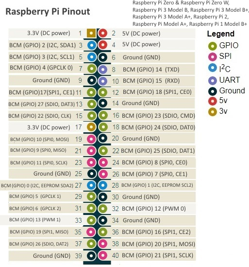
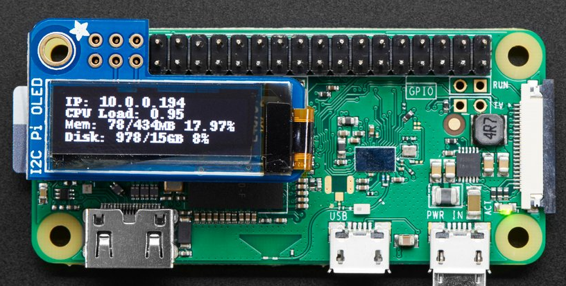

# Setting up Wiring and Pins Locations

The following guide goes over wiring of the hardware to the Raspberry Pi.

## Pinout Diagram

Notice there is a distinction between physical pins and BCM number.

## Display

The display is designed to occupy the top 6 pins of the header to operate over I2C communication. This is shown in the image below. No pin assignments are changed from this design.

## RTD Temperature Sensor

The RTD temerature sensor operates over SPI. The following pin assingments are used to interact with the MAX31865 RTD amplifier

Pi 3V (physical pin 17) to sensor VIN
Pi SPI_MOSI (physical pin 19, BCM 10) to sensor SDI
Pi SPI_MISO (physical pin 21, BCM 9) to sensor SDO
Pi SPI_SCLK (physical pin 23, BCM 11) to sensor CLK
Pi SPI_CE0 (physical pin 24, BCM 8) to sensor CS
Pi GND (physical pin 25) to sensor GND

    _pump_out = 32  #BCM 32, physical pin 32
    _heater_out = 18  #BCM 18, physical pin 12
    _on_switch_in = 17  #BCM 17, physical pin 11
    _steam_switch_in = 27  #BCM 27, physical pin 13
    _brew_switch_in = 22  #BCM 22, physical pin 15
